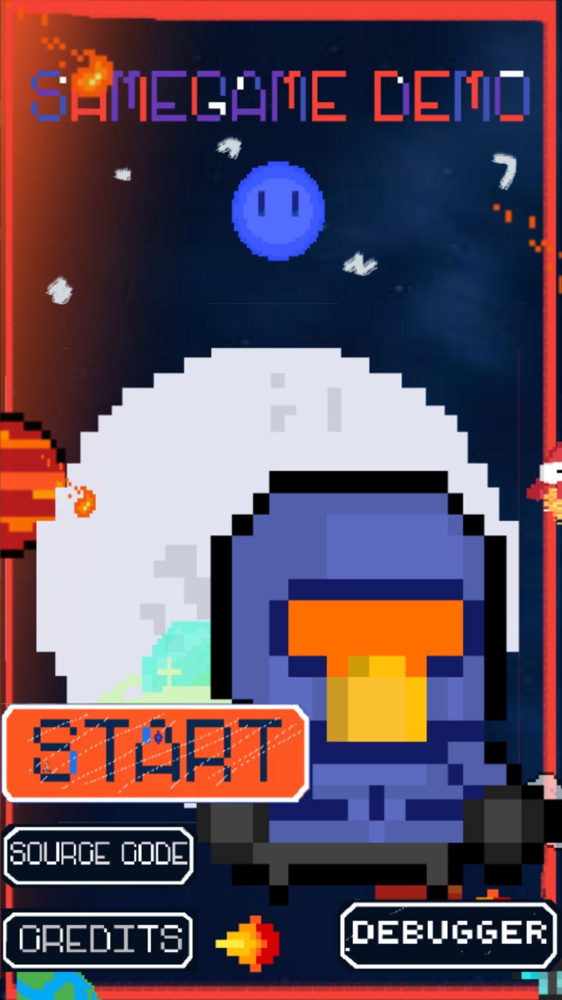
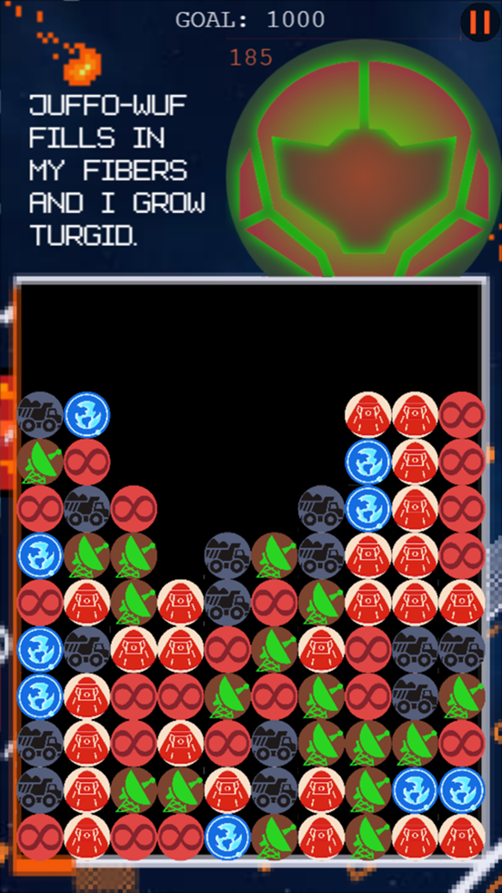
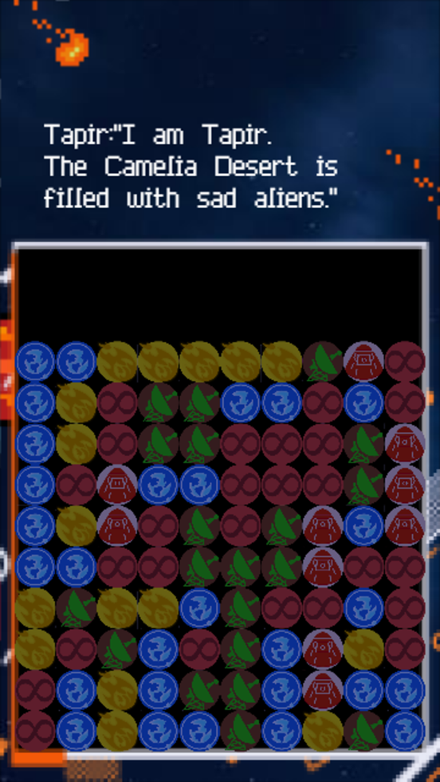
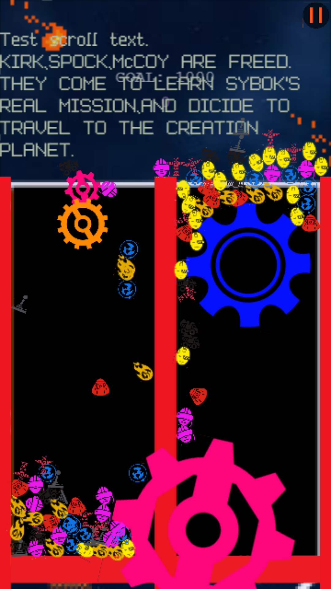
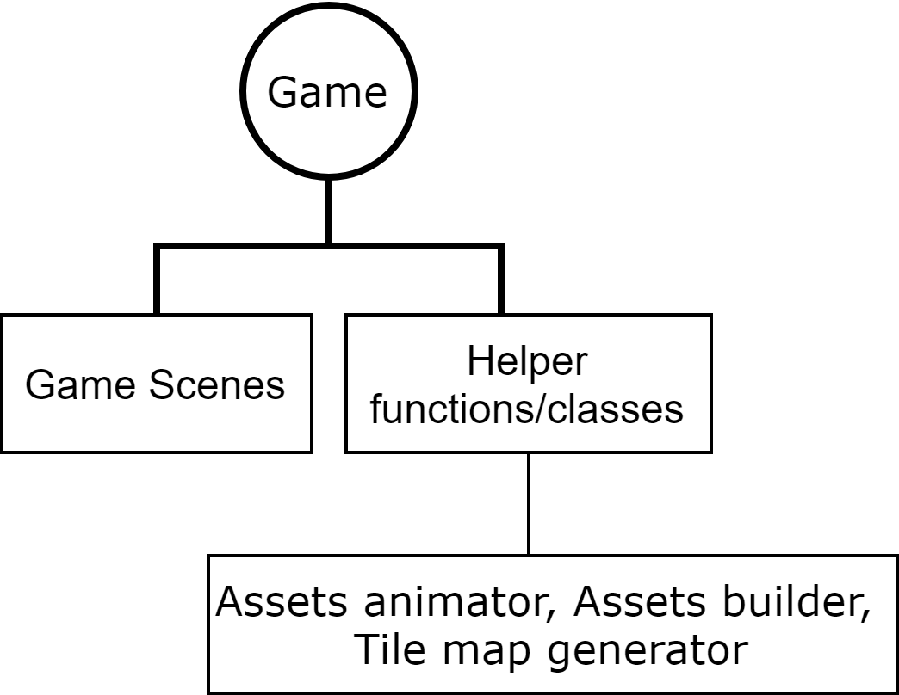
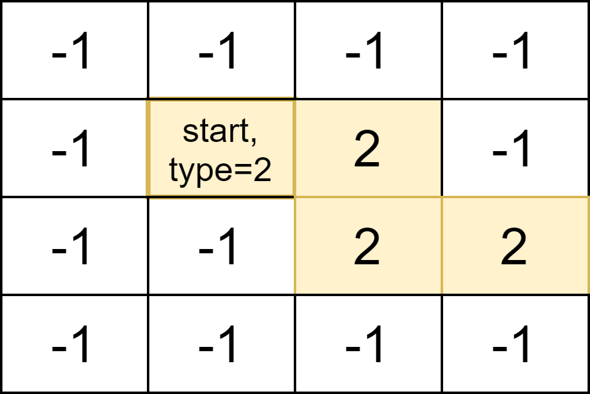
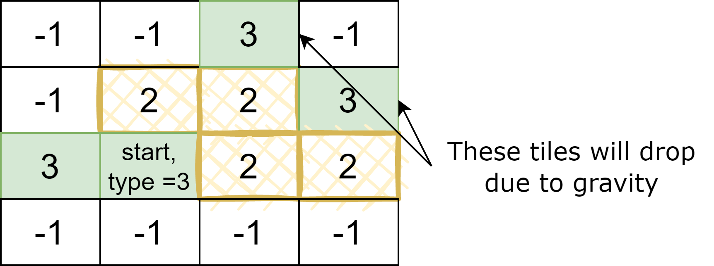
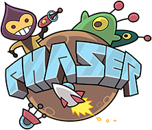
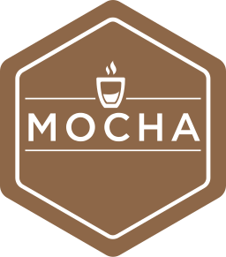
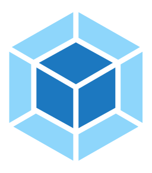

## A Phaser 3 SameGame


> #Tile-matching puzzle

A demo Tile-matching web game built using [Phaser 3](https://phaser.io/phaser3). The name **SameGame** is a reference to the game originally release in 1985 by [Kuniaki Moribe](https://en.wikipedia.org/wiki/SameGame).

#### [Live Demo](https://hl778.github.io/SameGame-Phaser3/demo/)

#### Screenshots

 
 
 


## Table of content

<!--ts-->
  * [Quick Start](#quick-start)
  * [Features](#features)
  * [Gameplay](#gameplay)
  * [Developing](#developing)
    + [Building](#building)
    + [Testing](#testing)
  * [Code Logic](#code-logic)
    + [Generating Tile Map](#generating-tile-map)
    + [Shifting Columns](#shifting-columns)
    + [Locating Adjacent Tiles](#locating-adjacent-tiles)
    + [About Arcade Physics engine](#about-arcade-physics-engine)
  * [Tech Stack](#tech-stack)
  * [Credits](#credits)
  * [Contact](#contact)
  * [License](#license)
<!--te-->


## Quick Start


Install with npm and start the app:

```shell
npm install
npm run start
```

## Features

* :iphone: Cross platform. Game and assets scale is auto adjusted based on screen size and pixel aspect ratio.
* :wrench: Can change game settings. Such as number of tiles and tile types, score and difficulty.
* Test buttons lead to different game ending scenes.
* :microscope: A lab scene as a playground to experiment new ideas.
* Tiles implemented using Phaser [Arcade Physics](https://photonstorm.github.io/phaser3-docs/Phaser.Physics.Arcade.ArcadePhysics.html) engine.

## Gameplay 

**Goal:** 

- Eliminate all tiles .

**Rule:**

- Match 2 or more adjacent tiles of the same type to collect points.

**Endings:**

- Ending I (game over): Current score is lower than target.
- Ending II (good ending): Current score exceeds target with no tile left.

## Developing

To develop the app:

```shell
git clone https://github.com/hl778/SameGame-Phaser3.git
cd SameGame-Phaser3
npm install
npm run start:dev
```

Optionally, run `npm update`. 

### Building

To build the app:

```shell
npm run build
```

The built app is at `./dist` directory including all assets.

> The app includes 2 KB of CSS files which can be safely omitted if needed. They are used to importing fonts in game. 

Optionally, to run the built app:

```shell
npm run start:prod
```

### Testing

To run tests:

```shell
npm run test
```

Alternatively, view the test results in CLI, run:

```shell
npm run test:cli
```

> It is recommended to view the test in a web interface. The CLI has limited test cases. 


## Code Logic

The code logic separates into two parts:

 

Each scene is a class. Assets are generated by `Assets Builder` class. Assets animations are created by `Assets Animator` class. A `global setting` object stores variables for debugging and easy access.

### Generating Tile Map

Tile map is generated at the start of each level. The approach is to select a starting tile, mark its successive adjacent tiles as the same type, if they have not been marked. The logic can be separated into parts:

1. Initialize each tile with a value of -1 to indicate it has not been marked.
2. Select a starting tile has the value -1, decide the tile type to be marked and  the number of steps to take.
3. From the starting tile, go to its first neighbor has a value of -1, this may be at its top, down, left or right, mark it as the same type of the starting tile, decrease the number of step by 1. Repeat the step from the new neighbor until step count is 0. Then, repeat the step 2 to 3 until all tiles are marked.
4. If reach dead end in any direction for a given tile, mark this direction to indicate it is a dead end.
5. Take dropped tiles and shifted columns into consideration.

  

<p align = "left" style="color:grey;font-size:8px">
Figure 1: Define neighbors with dropped tiles..
</p> 

### Shifting Columns

A variable stores the number of tiles left per column. The columns will be shifted towards the left if there are empty spaces. 

### Locating Adjacent Tiles

Starting from a clicked tile, it uses [breadth-first search](https://en.wikipedia.org/wiki/Breadth-first_search) to locate adjacent tiles.

### About Arcade Physics engine

The game can be created without a physics engine. The reason to use it is to create a potential to expand the game into a physics-based game.  


## Tech Stack 

   

- Framework: [Phaser](https://phaser.io/)
- Language: [ES6](https://github.com/lukehoban/es6features#readme)
- Bundler: [Webpack](https://webpack.js.org/)
- Test: [Mocha](https://mochajs.org/)


## Credits

|                          **Source**                          |               **Used on**                |               **Description**               |
| :----------------------------------------------------------: | :--------------------------------------: | :-----------------------------------------: |
|             [Freepik](https://www.flaticon.com)              |                 Favicons                 |          Vector icons and stickers          |
|      [EDIT.COM GENERATOR](https://deathgenerator.com/)       |        Game ending screen content        | Generate classic video game "death" screens |
|             [Unsplash](https://www.unsplash.com)             |             Background image             |                   Images                    |
| [Delapouite](https://www.delapouite.com), [Lorc](https://www.lorcblog.blogspot.com), [DarkZaitzev](https://www.darkzaitzev.deviantart.com) |               Tile images                |        Tile images original authors         |
|             [Pixilart](https://www.pixilart.com)             | Game characters, buttons and side-assets |               Make pixel arts               |
|    [Free Texture Packer](https://www.free-tex-packer.com)    |              Packed assets               |            Create sprite sheets             |
|         [PhysicsEditor](https://www.codeandweb.com)          |             Physics polygons             |            Physics shape editor             |
| [Atari](https://en.wikipedia.org/wiki/Atari,_Inc._(publisher)), [Bandai](https://en.wikipedia.org/wiki/Bandai), [Toys for Bob](https://en.wikipedia.org/wiki/Toys_for_Bob), [Chris Gray Enterprises](https://en.wikipedia.org/wiki/Gray_Matter_(company)), [Sierra Online](https://en.wikipedia.org/wiki/Sierra_Entertainment), [Capcom](https://en.wikipedia.org/wiki/Capcom), [Crusader of Centy](https://en.wikipedia.org/wiki/Crusader_of_Centy#:~:text=Crusader%20of%20Centy%20is%20an,threaten%20the%20human%20race's%20existence.) |          Game dialogue contents          |               Content sources               |
| [Pixelation shader](https://www.geeks3d.com/20101029/shader-library-pixelation-post-processing-effect-glsl/) |           Ending scene effect            |               Shader library                |
| [BBCode Text](https://rexrainbow.github.io/C2RexDoc/c2rexpluginsACE/plugin_rex_bbcodetext.html) |                Game text                 |          Text with bbcode protocol          |
|  [Normalise.css](https://necolas.github.io/normalize.css/)   |                   CSS                    |                 CSS resets                  |
|      [rgb-hex](https://github.com/sindresorhus/rgb-hex)      |          Tile map viewer scene           |         Convert RGB(A) color to HEX         |


## Contact

Any questions or suggestions please contact hl778g@outlook.com.


## License

This project is licensed under the terms of the **[MIT](https://choosealicense.com/licenses/mit/)** license.


<p align="center">
    
</p>


<p align = "center" style="color:grey;font-size:3px">
Logo generated from <a href="www.game-icons.net">game-icons</a> under <a href="https://creativecommons.org/licenses/by/3.0/">CC BY 3.0</a>
</p>
